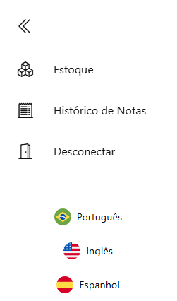
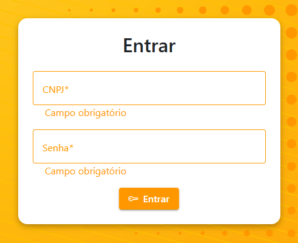
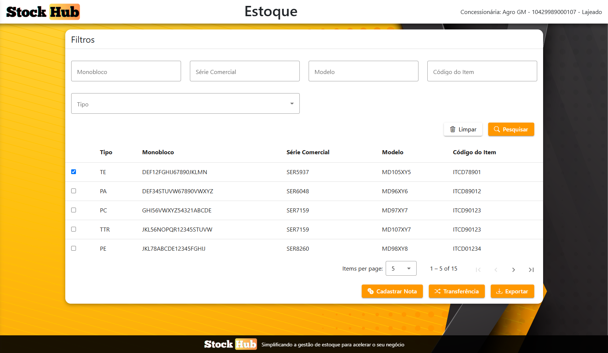
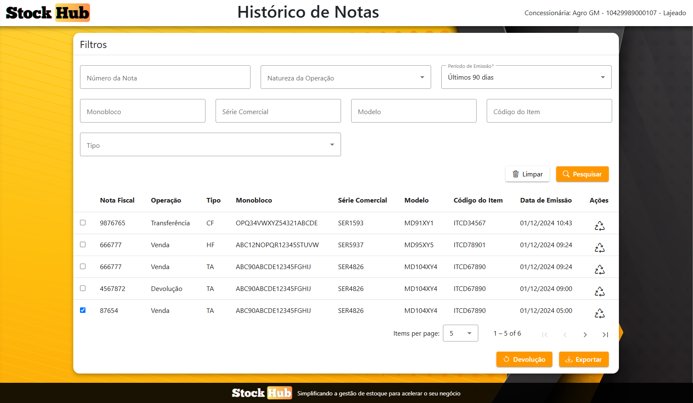
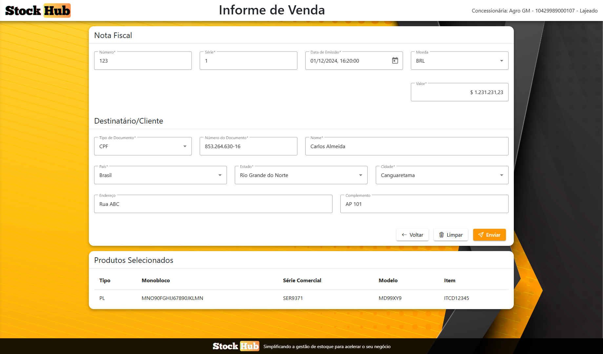
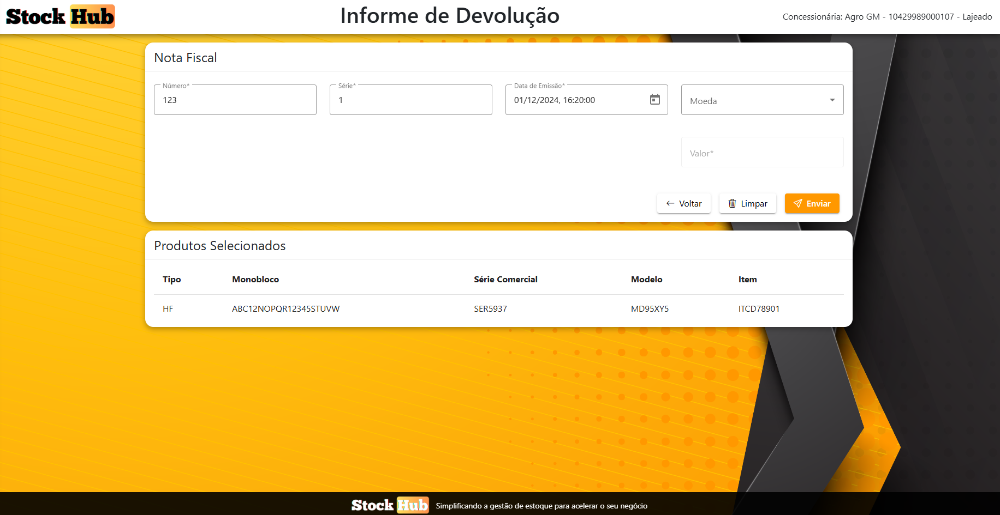
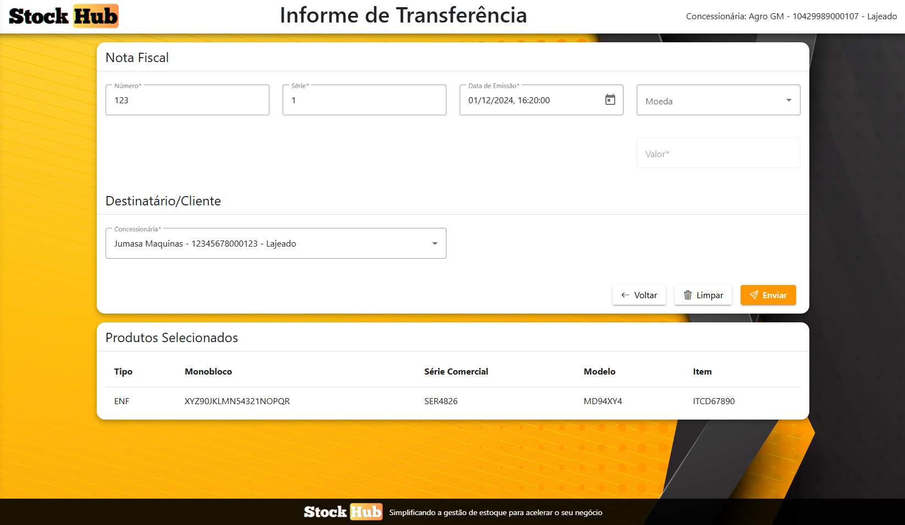
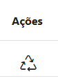
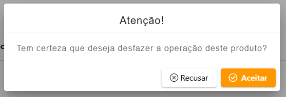
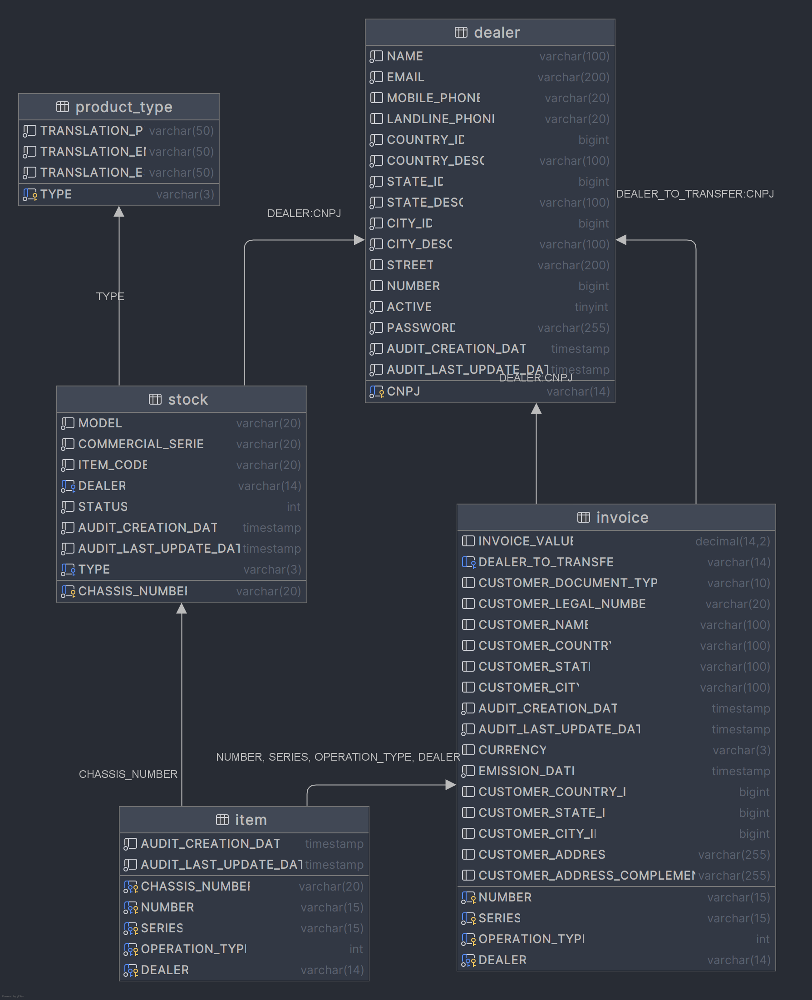

# StockHub

Bem-vindo à documentação do **StockHub**, uma aplicação desenvolvida para gerenciar operações de estoque e notas fiscais de concessionárias de forma eficiente e centralizada.

---

## Sumário

* [1. Visão Geral](#1-visão-geral)
* [2. Navegação](#2-navegação)
* [3. Login](#3-login)
* [4. Estoque da Concessionária](#4-estoque-da-concessionária)
  * [4.1. Operações](#41-operações)
* [5. Histórico de Notas](#5-histórico-de-notas)
    * [5.1. Operações](#51-operações)
* [6. Informe de Notas](#6-informe-de-notas)
  * [6.1. Venda](#61-venda)
  * [6.2. Devolução](#62-devolução)
  * [6.3. Transferência](#63-transferência)
* [7. Desfazimento de Operações](#7-desfazimento-de-operações)
* [8. Relatórios](#8-relatórios)
* [9. Diagrama ER](#9-diagrama-er)

---

## 1. Visão Geral

O **StockHub** é uma solução para o controle de estoque e gestão de notas fiscais de concessionárias. Ele foi projetado para otimizar processos, garantir conformidade e oferecer ferramentas analíticas através de relatórios.

Principais funcionalidades:
- Controle de estoque.
- Histórico completo e detalhado de notas fiscais.
- Geração e envio de relatórios customizados.
- Processos otimizados para desfazer operações incorretas.

---

## 2. Navegação

Através da barra lateral é possível acessar diferentes menus. Podendo serem clicados tanto com a barra colapsada ou não.

 

Também possui opção de 3 linguagens diferentes, sendo Português, Inglês e Espanhol.

---

## 3. Login

Cada concessionárias pode acessar a aplicação utilizando seu login (CNPJ) e senha. Ambos os campos são obrigatórios.

- Validações
  - Se usuário ou senha está incorreto

---

## 4. Estoque da Concessionária

Através da tela de estoque, é possível **filtrar** produtos disponíveis, selecionar produtos para **venda** e para **transferência**.
Também possui a capacidade de fazer o download de um arquivo no formato **xlsx** exportando os valores da tabela de estoque. 

### 4.1. Operações
  - **Informe de Venda:** ao selecionar um produto e clicar no botão `Cadastrar Nota` você é direcionado para a tela de [Informe de Venda](#61-venda) com os produtos selecionados.
  - **Informe de Transferência:** ao selecionar um produto e clicar no botão `Transferência` você é direcionado para a tela de [Informe de Transferência](#63-transferência) com os produtos selecionados.
  - **Exportar:** exporta os registros da tabela para uma planilha no formato xlsx.

---

## 5. Histórico de Notas

Nesta tela é possível filtrar todos os registros de operações ja realizadas nos produtos do estoque, como vendas, devoluções e transferências.

### 5.1. Operações
- **Informe de Devolução:** ao selecionar um produto e clicar no botão `Devolução` você é direcionado para a tela de [Informe de Devolução](#62-devolução) com os produtos selecionados.
  - Somente notas do tipo `Venda` podem ser selecionadas para serem devolvidas.
- **Exportar:** exporta os registros da tabela para uma planilha no formato xlsx com informações adicionais sobre cliente e destinatário.
- **Desfazer Operação:** abre a confirmação do [Desfazimento de Operação](#7-desfazimento-de-operações) para desfazer a operação selecionada.

---

## 6. Informe de Notas

### 6.1. Venda

Ao selecionar um produto e ser direcionado para esta tela, é necessário preencher os campos com informações sobre a nota e o cliente.

- **Campos Opcionais**
  - `Moeda e Valor` - porém se selecionada uma moeda, o valor se torna obrigatório.
  - `Endereço` - rua, bairro, numero...
  - `Complemento` - numero do apartamento, ponto de referência...
- **Validações**
  - Produtos precisam estar disponíveis
  - A nota não pode ja existir no sistema
  - A data de emissão não pode ser posterior a data atual
  - Não pode existir uma nota com a data de emissão mais recente para os produtos selecionados

### 6.2. Devolução

Na tela de devolução, não é necessário informar dados sobre o cliente, pois terá como base o cliente da nota de venda sendo devolvida.

- **Campos Opcionais**
  - `Moeda e Valor` - porém se selecionada uma moeda, o valor se torna obrigatório.
- Validações
    - A nota não pode ja existir no sistema
    - A data de emissão não pode ser posterior a data atual
    - Data de emissão da devolução não pose ser anterior a data do informe de venda
    - Não pode existir uma nota com a data de emissão mais recente para os produtos selecionados
    - Produtos selecionados não podem ser de informes de venda diferentes

### 6.3. Transferência

Na tela de transferência é necessário selecionar qual das outras concessionárias vinculadas irá receber o produto.

- **Campos Opcionais**
    - `Moeda e Valor` - porém se selecionada uma moeda, o valor se torna obrigatório.
- Validações
    - A nota não pode ja existir no sistema
    - A data de emissão não pode ser posterior a data atual
    - Não pode existir uma nota com a data de emissão mais recente para os produtos selecionados
    - Concessionária destino precisar estar ativa
---

## 7. Desfazimento de Operações

Ao clicar no botão de `Desfazer Operação`, na coluna `Ações` na tela de [Historico de Notas](#5-histórico-de-notas):

Surgirá a seguinte janela de diálogo com a confirmação:

Ao aceitar, a operação será desfeita e a nota será apagada, e o produto retorna para o estado anterior ao processo desfeito.

- Validações
  - Não pode haver uma nota mais recente do que a da operação sendo desfeita
    - Ex.: Caso o produto tenha sido transferido e vendido pelo destinatário, a operação de transferência não pode ser desfeita sem antes desfazer a venda. 

---

## 8. Relatórios

Ao clicar na botão `Exportar` nas telas de [Estoque](#4-estoque-da-concessionária) e de [Histórico de Notas](#5-histórico-de-notas) 
será feito o download de um arquivo xlsx com os dados das respectivas tabelas.

### 8.1. Estoque
- Colunas
  - Concessionária
    - CNPJ
    - Nome
    - País
    - Estado
    - Cidade
  - Produto
    - Tipo
    - Monobloco
    - Série Comercial
    - Modelo
    - Cód. do Item

### 8.2. Histórico de Notas
- Colunas
    - Concessionária
        - CNPJ
        - Nome
        - País
        - Estado
        - Cidade
    - Nota Fiscal
      - Número
      - Série
      - Tipo de Operação
      - Data de Emissão
      - Moeda e Valor
    - Cliente/Destinatário
      - Tipo de Documento
      - Número de Documento
      - Nome
      - País
      - Estado
      - Cidade
      - Endereço
      - Complemento
    - Produto
        - Tipo
        - Monobloco
        - Série Comercial
        - Modelo
        - Cód. do Item

---

## 9. Diagrama ER

---
